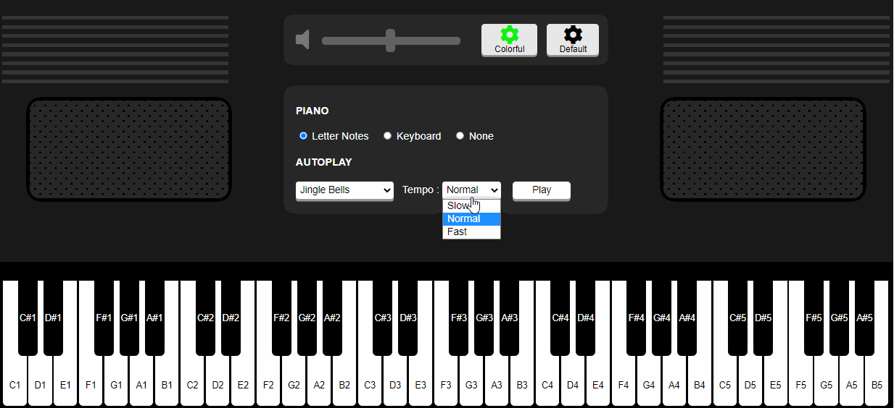

# Virtual Piano

### > This virtual piano has been build in HTML, CSS, and JavaScript.  It has the functionality of three different keyboard layouts. Also, the keys' color can be changed as well. 
### > Apart from these, 2 predefined songs, "Happy Birthday" &amp; " Jingle Bells" has also been added which can be played directly. Click here to check it out 👉 <a href ="https://purushottam-bca.github.io/Virtual_Piano/" >Click here </a>

